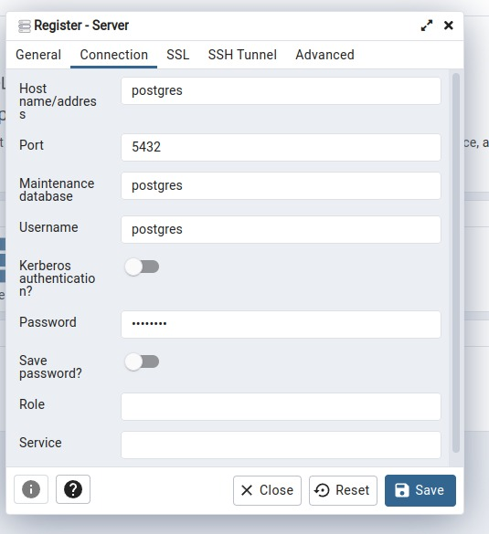
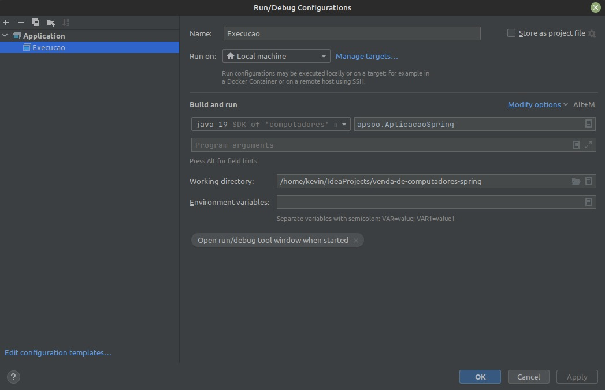

-<p align="left">   

</p>

# Sistema de Venda de Computadores

## Descrição

<p align="left"> Projeto realizado durante a disciplina de análise de projeto de software orientado a objetos, onde o objetivo  
 é permitir a venda de computadores previamente cadastrados. Para esse projeto foi utilizado postgres como banco de dados e a implementação do código foi em Java + Spring Boot  e para o front aplicado JavaFX. </p>

## Instalação

Necessário ter a JDK instalado na máquina ou pode optar por deixar a intelij (IDE da Jetbrains) definir o JDK 19 automaticamente ou instalar seguindo a documentação abaixo :

- JDK https://www.oracle.com/java/technologies/downloads/
- IntelliJ IDEA
  https://www.jetbrains.com/idea/old/

### Configuração do Banco

Para rodar o projeto é necessário ter o postgres disponível e rodando na porta 4090, recomendamos o uso do docker para facilitar o seu uso:  
https://docs.docker.com/get-docker/.

Com o docker disponível em sua máquina use o seguinte comando:

```bash
$ docker compose up
```

Com o docker rodando acesse o http://localhost:8090/login?next=%2F
Será a porta em que estará disponível o pgadmin para poder conectar e visualizar os dados do banco de dados.
No pgadmin insira user como "admin@admin.com" e senha como "root".
Acesse o campo "add new server"
e passe as seguintes informações:



### Execução do projeto

- Execute o arquivo ApliacaoSpring.java
- Recomendo a inteliJ como IDE para execução do projeto
- Por meio dela pode criar um "Run Configuration" e facilitar a execução do mesmo, como o exemplo abaixo:
  
- o Arquivo Computadores Application pode ser comentada após a primeira execução, 
pois se executado novamente ocasiona erro por tentar adicionar uma pessoa com cpf já previamente cadastrada.
